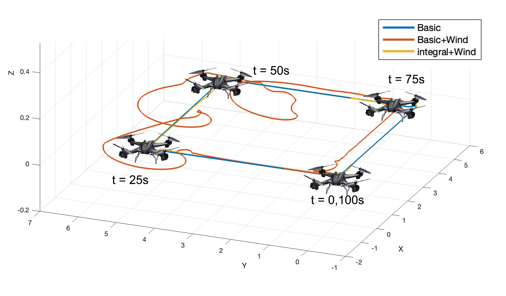
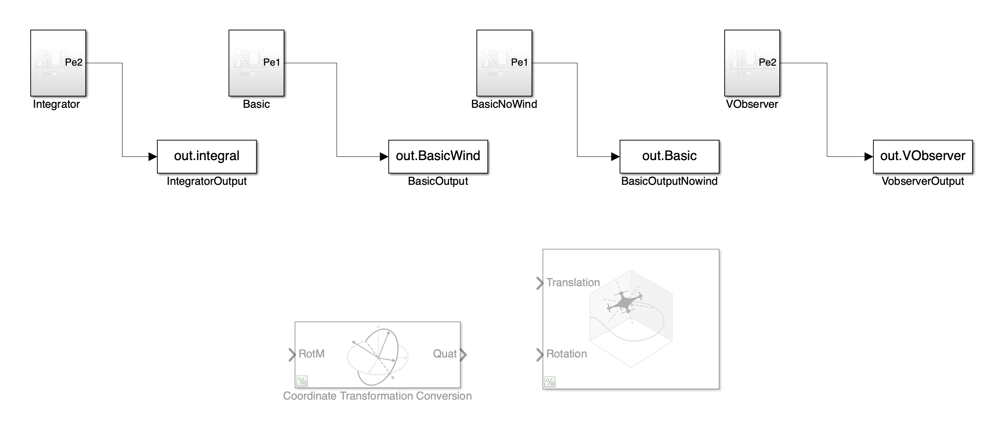

# UAV LQR Control in MATLAB

This MATLAB project demonstrates the implementation of a Linear Quadratic Regulator (LQR) controller and Luenberger Observer for a UAV (Unmanned Aerial Vehicle).

## Project Objectives

1. Effectively simulate the dynamics of a quadrotor in MATLAB/Simulink.
2. Design a controller for trajectory tracking that can handle linear trajectories, using the Linear Quadratic Regulator (LQR).
3. Evaluate the performance of the closed-loop system through simulations to ensure that it meets the design specifications.
4. Introduce a constant external force disturbance in the model that simulates a constant wind.
5. Design a linear controller that can automatically compensate for the disturbance.
6. Visualize the quadrotor's motion and the results of the tracking controllers in a real-time animated plot to analyze and present the system's behavior.

## Getting Started

1. Clone or download the repository to your local machine.
2. Open MATLAB and navigate to the project directory.

## File Description

- `model_LQR_Obsever.m`: The main script that executes the UAV LQR & Integrator & obsever. Modify this file to adjust the control gains and cost function weights.
- `Basic_Linear_model.m`: Basic UAV’s Model script.
- `QRotorSimulation.slx`: Simulation of  LQR controller design. Modify this file to adjust the control gains and cost function weights.
- `skew.m`:  functions for calculate the skew matrix.
- `visualization.m`: UAV path visualization.

## Usage

1. Open `model_LQR_Obsever.m` and  `Basic_Linear_model.m` in MATLAB and run it get the controller gain.
2. Open`QRotorSimulation.slx` ,there are four part of different situations, run it for simulation respectively.
3. Specify the initial conditions, desired states, and other control parameters.
4. use `visualization.m` or UAV toolbox to watch the flight path

## Different situations

1. Integrator: Model with integrator part to against the wind distribution.
2. Basic: Basic model with no wind condition.
3. BasicNoWind:Basic model with wind condition.
4. VObserver: Model without velocity state use Luenberger Obsever.
